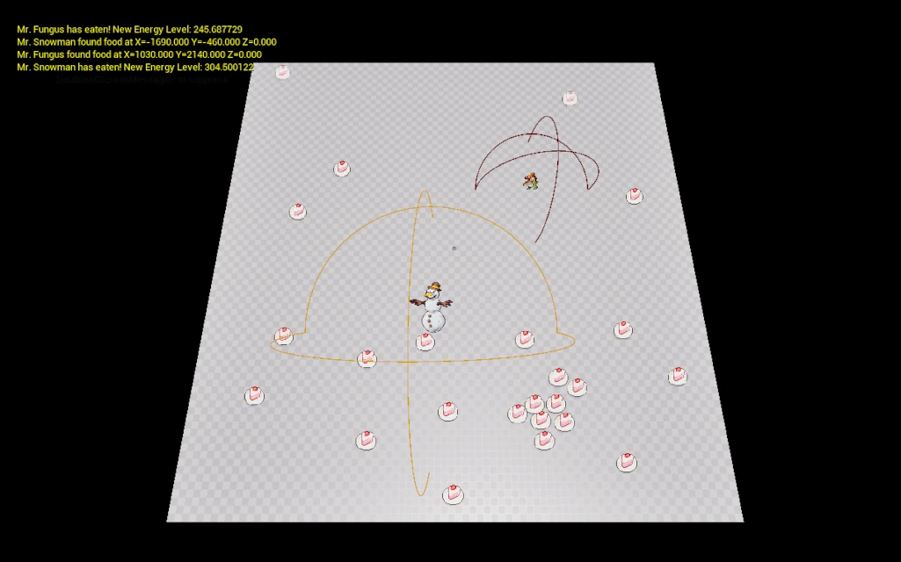
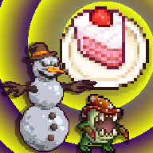
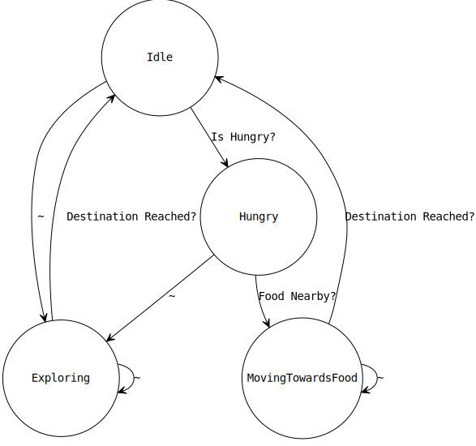

# Unreal Plugins Start - Cakes And Monsters

This is an Unreal Engine tutorial project showing how to create and use plugins, with C++ and Blueprints.

## What to look for in this demo?

This is a tutorial code aiming to show you how to work with the following:

- Data only plugins creation and usage.
- C++ plugins creation and usage.
- using Actor and ActorComponent to implement gameplay features.
- How to use/show pixel art sprites living in a 3D world.
- How to create and use a Blueprint library, providing extra functionality.
- Defining and using a dedicated log channel, so you can filter these messages easily in a large code base. Check out MonsterLog.h
- How to use Enums defined from C++.
- Using tags to filter out actors.

## How does it work?

In this world, there are Cakes and there are Monsters. Both of them are striving to survive in this delicious world. they have slightly different stats. But the thing is, if they are hungre, they need to eat. Their behavior is implemented as the following state machine:

## So this is not a game...

Well, it does not handle user inputs, however, the starting position of the monsters are randomized. So it is a mistery who would survive starvation first. The real game is in front of the screen, where you can gamble anything. Let us say, who do the dishes, a beer, a car, or even a delicious cake. Posibilities are endless, it is your call.

## Art?

The assets used in this demo were handpicked from the following free gorgeous asset packs. My sincere thanks to the original authors!.
- https://free-game-assets.itch.io/free-low-level-monsters-pixel-icons-3232
- https://ghostpixxells.itch.io/pixelfood
- https://holder-anibat.itch.io/holders-animated-battlers-free-enemies-pack-1

## Ok, cool, but I learn better with a video.

Sure!, a video is in the works, check out my YouTube channel: https://www.youtube.com/@4druntime